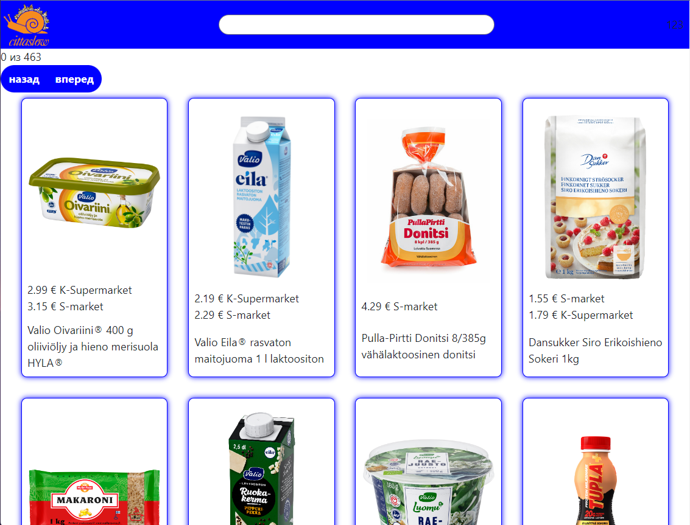
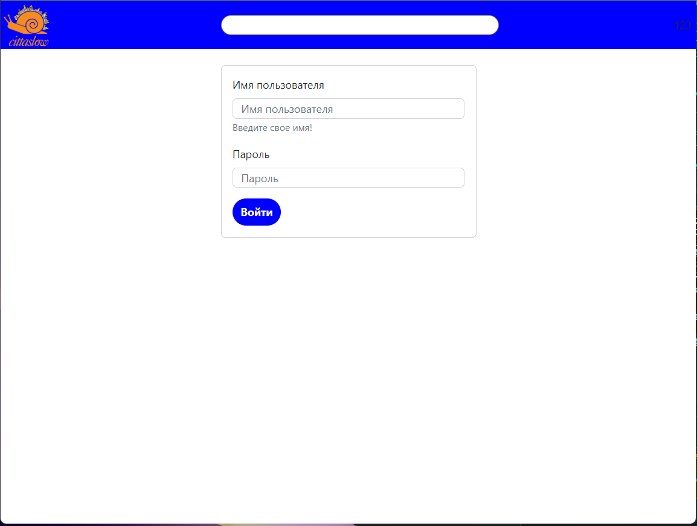
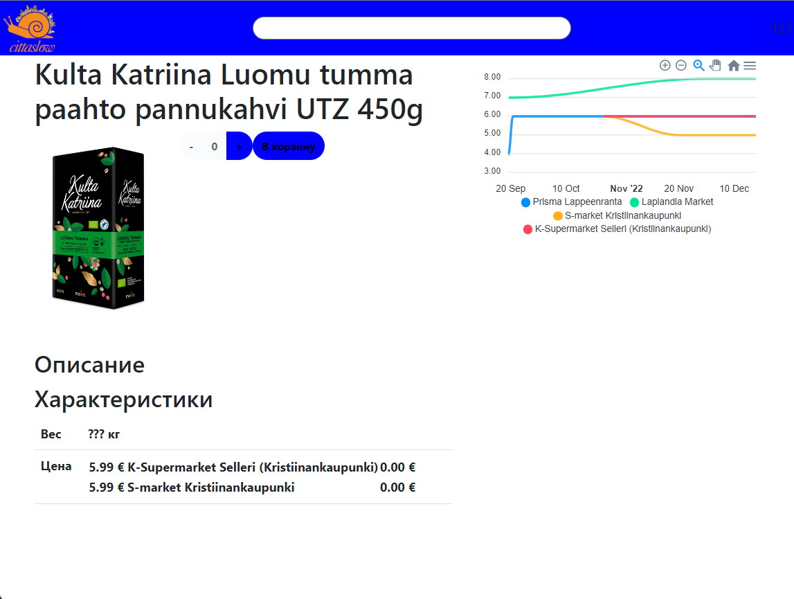
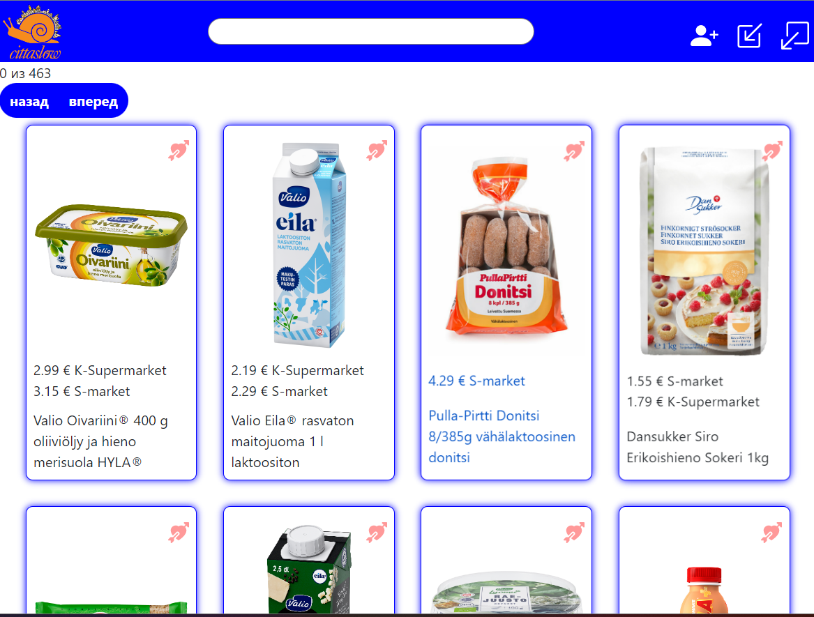
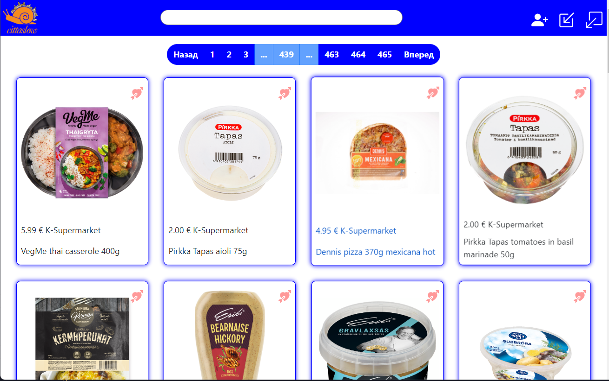
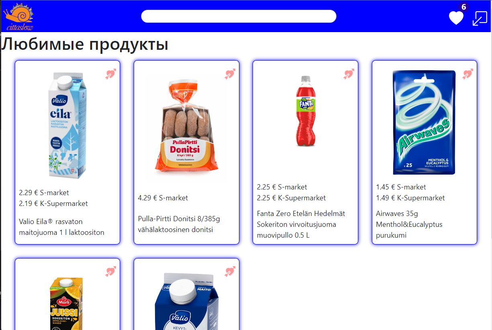
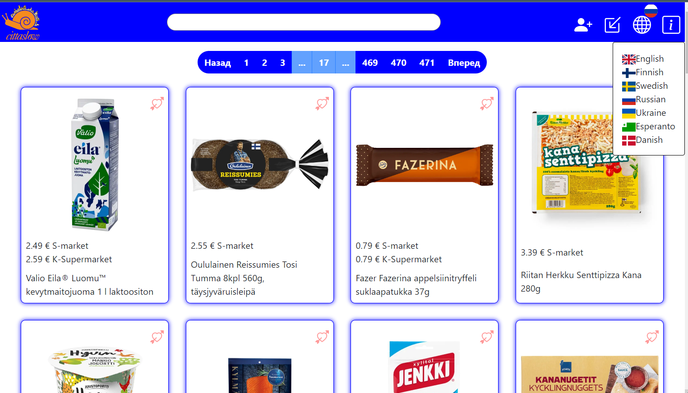
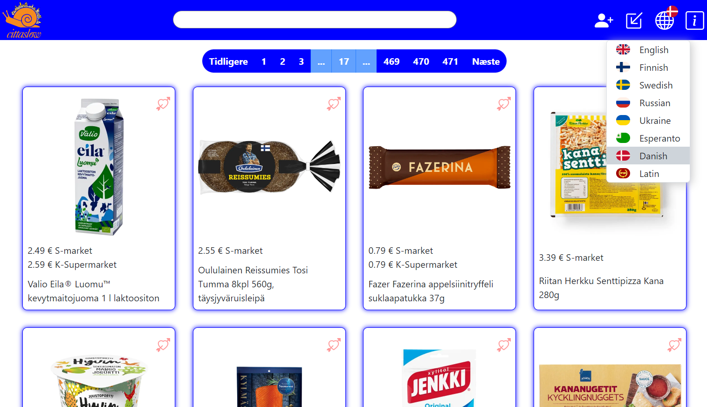

# Project shops-prices 

> Note: Данный проект находится в разработке
>
> Превью: https://sl40.6400444.ru/shop-prices

## Используемые технологии:
* [React](https://reactjs.org/)
* [TypeScript](https://www.typescriptlang.org/)
* [React bootstrap](https://react-bootstrap.netlify.app/)
* [ApexCharts](https://apexcharts.com/)
* Backend от [@Irelynx](https://github.com/Irelynx)
  * Node.js (Express, TypeScript, Sequelize, Postgres)

## Скриншоты:

### Каталог

### Авторизация

### Регистрация

### Карточка товара

### Добавлены лайки и иконки регистрации, входа/выхода 

### Добавлена пагинация 

### Добавлена страница "Любимые продукты"

### Добавлена страница "Разработчики"

### Добавлено несколько языков интерфейса

###  Изменен дизайн выбора языка [@Rtif173](https://github.com/Rtif173)
